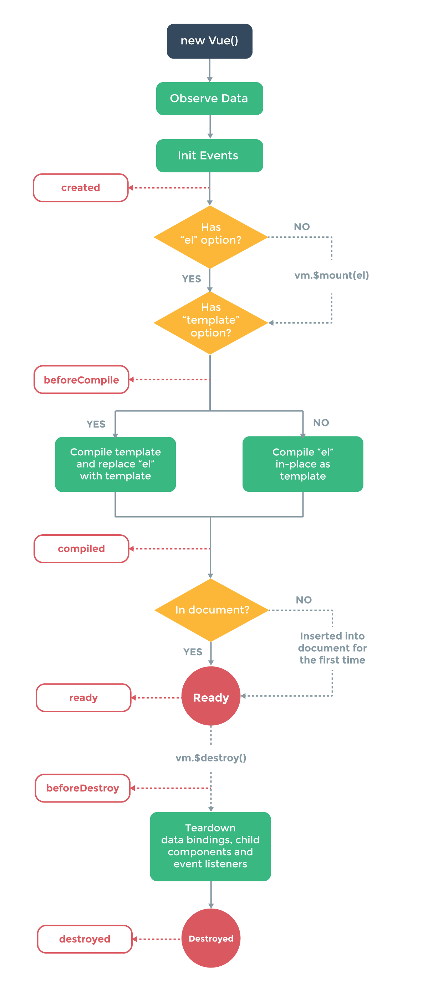

VUE
===

### Global Config

```js
Vue.config.debug = true
Vue.config.delimiters = ['${', '}']
Vue.config.unsafeDelimiters = ['{!!', '!!}']
Vue.config.silent = true
Vue.config.async = false
Vue.config.devtools = true
```

### Global API

* Vue.extend
* Vue.nextTick
* Vue.set
* Vue.delete
* Vue.directive
* Vue.elementDirective
* Vue.filter
* Vue.component
* Vue.transition
* Vue.partial
* Vue.use
* Vue.mixin

### Vue Instance

每个Vue.js应用的起步都是通过构造函数 Vue 创建一个 Vue 的根实例。
```js
var vm = new Vue({/*选项*/});
```

在实例化 Vue 时，需要传入一个选项对象，它可以包含数据、模板、挂载元素、方法、生命周期钩子等选项。

* el
* data
* created
* destroyed

---
* compiled

```html
<div id="example"> a={{ a }}, b={{ b }} </div>
```

```js
var vm = new Vue({
  el: '#example',
  data: {
    a: 1
  },
  computed: {
    // 一个计算属性的 getter
    b: function () {
      // `this` 指向 vm 实例
      return this.a + 1
    }
  }
})
```

result:
```
a=1,b=2
```

```html
<div id="demo">{{fullName}}</div>
```

```js
var vm = new Vue({
  data: {
    firstName: 'Foo',
    lastName: 'Bar'
  },
  computed: {
    fullName: function () {
      return this.firstName + ' ' + this.lastName
    }
  }
})
```

setter:
```js
var vm = new Vue({
  data: {
    firstName: 'Foo',
    lastName: 'Bar'
  },
  computed: {
    fullName: {
        // getter
        get: function () {
          return this.firstName + ' ' + this.lastName
        },
        // setter
        set: function (newValue) {
          var names = newValue.split(' ')
          this.firstName = names[0]
          this.lastName = names[names.length - 1]
        }
      }
    }
})
```
现在在调用 vm.fullName = 'John Doe' 时，setter 会被调用，vm.firstName 和 vm.lastName 也会有相应更新。


---
* ready

* template

* components

```js
// 在一个步骤中扩展与注册
Vue.component('my-component', {
  template: '<div>A custom component!</div>'
})

// 局部注册也可以这么做
var Parent = Vue.extend({
  components: {
    'my-component': {
      template: '<div>A custom component!</div>'
    }
  }
})
```

* props

```js
Vue.component('example', {
  props: {
    // 基础类型检测 （`null` 意思是任何类型都可以）
    propA: Number,
    // 多种类型 (1.0.21+)
    propM: [String, Number],
    // 必需且是字符串
    propB: {
      type: String,
      required: true
    },
    // 数字，有默认值
    propC: {
      type: Number,
      default: 100
    },
    // 对象/数组的默认值应当由一个函数返回
    propD: {
      type: Object,
      default: function () {
        return { msg: 'hello' }
      }
    },
    // 指定这个 prop 为双向绑定
    // 如果绑定类型不对将抛出一条警告
    propE: {
      twoWay: true
    },
    // 自定义验证函数
    propF: {
      validator: function (value) {
        return value > 10
      }
    },
    // 转换函数（1.0.12 新增）
    // 在设置值之前转换值
    propG: {
      coerce: function (val) {
        return val + '' // 将值转换为字符串
      }
    },
    propH: {
      coerce: function (val) {
        return JSON.parse(val) // 将 JSON 字符串转换为对象
      }
    }
  }
})
```

* methods

组件实例的作用域是孤立的。这意味着不能并且不应该在子组件的模板内直接引用父组件的数据。可以使用 props 把数据传给子组件。


可以扩展 Vue 构造器，从而用预定义选项创建可复用的组件构造器：

```js
var MyComponent = Vue.extend({
  // 扩展选项
});

// 所有的 `MyComponent` 实例都将以预定义的扩展选项被创建
var myComponentInstance = new MyComponent();
```

* activate

```js
Vue.component('activate-example', {
  activate: function (done) {
    var self = this
    loadDataAsync(function (data) {
      self.someData = data
      done()
    })
  }
})
```

生命周期图示：



### 数据绑定

```html
<span>Message: {{ msg }}</span>
<span>This will never change: {{* msg }}</span>
<div>{{{ raw_html }}}</div>
<div id="item-{{ id }}"></div>

{{ number + 1 }}
{{ ok ? 'YES' : 'NO' }}
{{ message.split('').reverse().join('') }}

<!-- 这是一个语句，不是一个表达式： -->
{{ var a = 1 }}

<!-- 流程控制也不可以，可改用三元表达式 -->
{{ if (ok) { return message } }}


Vue.js 允许在表达式后添加可选的“过滤器 (Filter) ”，以“管道符”指示：

{{ message | capitalize }}
这里我们将表达式 message 的值“管输（pipe）”到内置的 capitalize 过滤器，这个过滤器其实只是一个 JavaScript 函数，返回大写化的值。Vue.js 提供数个内置过滤器，在后面我们会谈到如何开发自己的过滤器。

注意管道语法不是 JavaScript 语法，因此不能在表达式内使用过滤器，只能添加到表达式的后面。

过滤器可以串联：

{{ message | filterA | filterB }}
过滤器也可以接受参数：

{{ message | filterA 'arg1' arg2 }}
过滤器函数始终以表达式的值作为第一个参数。带引号的参数视为字符串，而不带引号的参数按表达式计算。这里，字符串 'arg1' 将传给过滤器作为第二个参数，表达式 arg2 的值在计算出来之后作为第三个参数。
```


### Class 绑定

数据绑定一个常见需求是操作元素的 class 列表和它的内联样式。因为它们都是 attribute，我们可以用 v-bind 处理它们：只需要计算出表达式最终的字符串。不过，字符串拼接麻烦又易错。因此，在 v-bind 用于 class 和 style 时，Vue.js 专门增强了它。表达式的结果类型除了字符串之外，还可以是对象或数组。

```html
<div class="static" v-bind:class="{ 'class-a': isA, 'class-b': isB }"></div>
<div v-bind:class="[classA, classB]">
<div v-bind:class="[classA, isB ? classB : '']">
<div v-bind:class="[classA, { classB: isB, classC: isC }]">
```

```js
data: {
  isA: true,
  isB: false,
  classA: 'class-a',
  classB: 'class-b'
}
```

### Style 绑定

```html
<div v-bind:style="{ color: activeColor, fontSize: fontSize + 'px' }"></div>
<div v-bind:style="[styleObjectA, styleObjectB]">
```

```js
data: {
  styleObject: {
    color: 'red',
    fontSize: '13px'
  }
}
```

当 v-bind:style 使用需要厂商前缀的 CSS 属性时，如 transform，Vue.js 会自动侦测并添加相应的前缀。

### 指令

* v-if-else
* v-show
* v-for
* v-on

```html
<div id="example">
  <button v-on:click="greet">Greet</button>
</div>
```

```js
var vm = new Vue({
  el: '#example',
  data: {
    name: 'Vue.js'
  },
  // 在 `methods` 对象中定义方法
  methods: {
    greet: function (event) {
      // 方法内 `this` 指向 vm
      alert('Hello ' + this.name + '!')
      // `event` 是原生 DOM 事件
      alert(event.target.tagName)
    }
  }
})

// 也可以在 JavaScript 代码中调用方法
vm.greet() // -> 'Hello Vue.js!'
```

```html
<div id="example-2">
  <button v-on:click="say('hi')">Say Hi</button>
  <button v-on:click="say('what')">Say What</button>
</div>
```

```js
new Vue({
  el: '#example-2',
  methods: {
    say: function (msg) {
      alert(msg)
    }
  }
})
```

```html
<button v-on:click="say('hello!', $event)">Submit</button>
```

```js
methods: {
  say: function (msg, event) {
    // 现在我们可以访问原生事件对象
    event.preventDefault()
  }
}
```

### 事件修饰符
```html
<!-- 阻止单击事件冒泡 -->
<a v-on:click.stop="doThis"></a>

<!-- 提交事件不再重载页面 -->
<form v-on:submit.prevent="onSubmit"></form>

<!-- 修饰符可以串联 -->
<a v-on:click.stop.prevent="doThat">

<!-- 只有修饰符 -->
<form v-on:submit.prevent></form>

<!-- 添加事件侦听器时使用 capture 模式 -->
<div v-on:click.capture="doThis">...</div>

<!-- 只当事件在该元素本身（而不是子元素）触发时触发回调 -->
<div v-on:click.self="doThat">...</div>
```

### 按键修饰符

```html
<!-- 只有在 keyCode 是 13 时调用 vm.submit() -->
<input v-on:keyup.13="submit">

<!-- 同上 -->
<input v-on:keyup.enter="submit">

<!-- 缩写语法 -->
<input @keyup.enter="submit">
```

全部的按键别名：

* enter
* tab
* delete
* esc
* space
* up
* down
* left
* right
* A-Za-z0-9F1-F12...

### 表单控件绑定

可以用 `v-model` 指令在表单控件元素上创建双向数据绑定。


